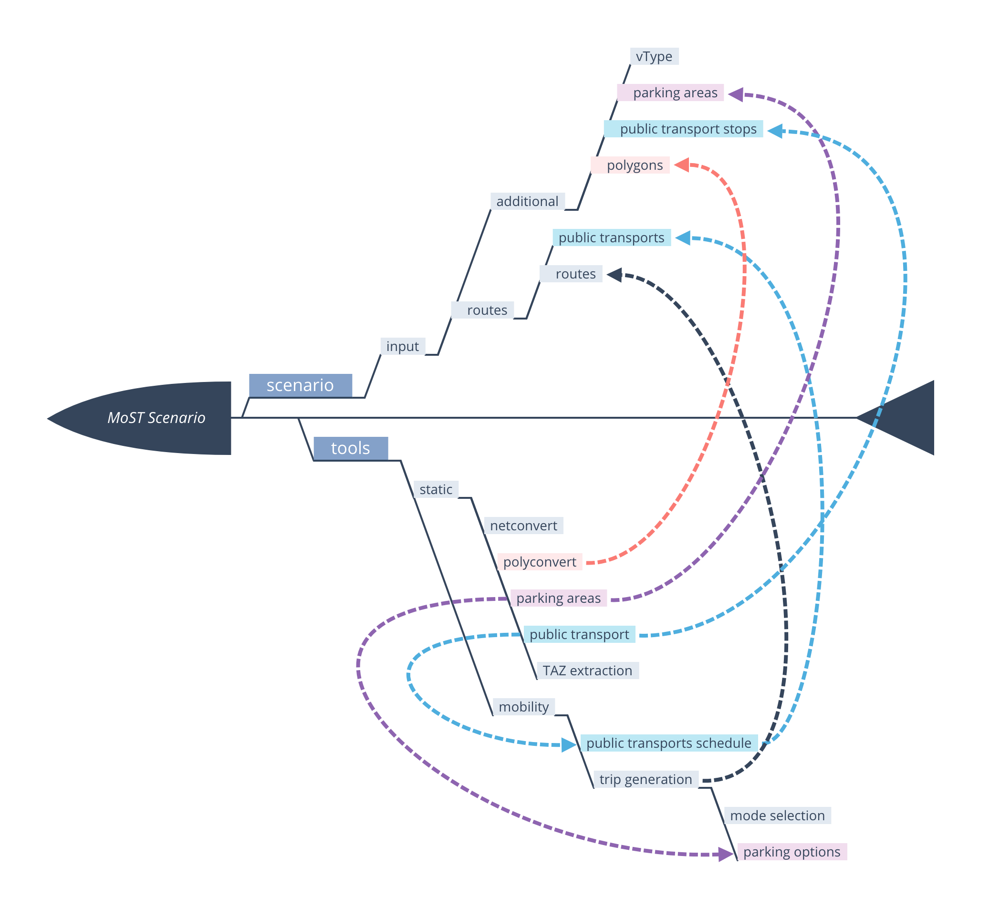

# Monaco SUMO Traffic (MoST) Scenario

Contacts: Lara CODECA [lara.codeca@gmail.com], Jerome HAERRI [haerri@eurecom.fr]

This project is licensed under the terms of the GPLv3 license.

MoST Scenario is meant to be used with SUMO (Simulator of Urban MObility).

* The master is tested with [SUMO 1.14.0](https://github.com/eclipse/sumo/tree/v1_14_0)
* In case there are problems with multi-threading, check that [Issue #4518](https://github.com/eclipse/sumo/issues/4518) has been solved in your target version.

Please refer to the [SUMO wiki](http://sumo.dlr.de/wiki/Simulation_of_Urban_MObility_-_Wiki) for further information on the simulator itself.

## How to cite it: [BibTeX](cite.bib)

L. Codeca, J. Härri,
*"Towards Multimodal Mobility Simulation of C-ITS: The Monaco SUMO Traffic Scenario"*
VNC 2017, IEEE Vehicular Networking Conference
November 27-29, 2017, Torino, Italy.

or

L. Codeca, J. Härri,
*"Monaco SUMO Traffic (MoST) Scenario: A 3D Mobility Scenario for Cooperative ITS"*
SUMO 2018, SUMO User Conference, Simulating Autonomous and Intermodal Transport Systems
May 14-16, 2018, Berlin, Germany

## How To

MoST Scenario can be lunched directly with its configuration file.

* `sumo -c most.sumocfg` or `run.sh` from the _scenario_ folder.

See [tools HOWTO](tools/HOWTO.md) for further details on how to chance and rebuild the scenario.

### Overview



### Mobility Example

[](https://www.youtube.com/watch?v=nFVhodnJKws)
(click on the image for the video)

### Traffic Light Example

[](https://www.youtube.com/watch?v=Wwp_riSsLAs)
(click on the image for the video)

### Public Transportation Example

[](https://www.youtube.com/watch?v=r7iE3LRiSNA)
(click on the image for the video)

## The master is tested with Eclipse SUMO Version 1.14.0

(Build features: Darwin-21.5.0 arm64 Clang 13.1.6.13160021 Release FMI Proj GUI SWIG GDAL FFmpeg OSG GL2PS)

```
Performance: 
Performance:
 Duration: 3407.14s
 Real time factor: 10.566
 UPS: 352602.634584
 UPS-Persons: 49427.018430
Vehicles:
 Inserted: 46842
 Running: 31
 Waiting: 0
Teleports: 99 (Jam: 29, Yield: 55, Wrong Lane: 15)
Emergency Stops: 6
Persons:
 Inserted: 45000
 Running: 26
 Jammed: 3865
Statistics (avg of 43356):
 RouteLength: 7217.10
 Speed: 6.98
 Duration: 6892.62
 WaitingTime: 52.51
 TimeLoss: 148.27
Bike Statistics (avg of 3455):
 RouteLength: 1876.49
 Speed: 4.53
 Duration: 428.03
 WaitingTime: 35.13
 TimeLoss: 64.48
Statistics (avg of 46811):
 DepartDelay: 0.37
Pedestrian Statistics (avg of 31421 walks):
 RouteLength: 451.37
 Duration: 387.66
 TimeLoss: 58.73
Ride Statistics (avg of 45216 rides):
 WaitingTime: 40.07
 RouteLength: 6058.59
 Duration: 609.21
 Bus: 5967
 Bike: 3455 
```

### Users

* Vincent Terrier, Aerospace System Design Laboratory, Georgia Institute of Technology, Atlanta, GA 30332-0105
* Tianshu Chu, Civil and Environmental Engineering, Stanford University

If you are using MoST Scenario, or its tools to generate a new one, we would gladly add you to the list.
You can send an e-mail to lara.codeca@gmail.com with your name and affiliation (if any).
